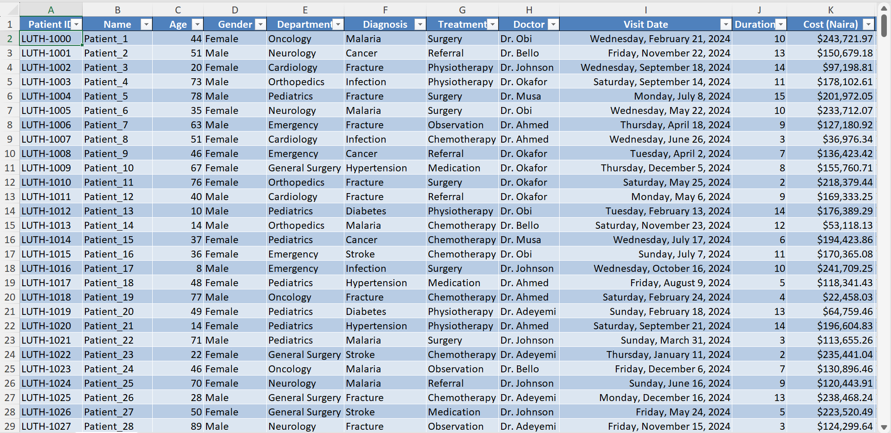
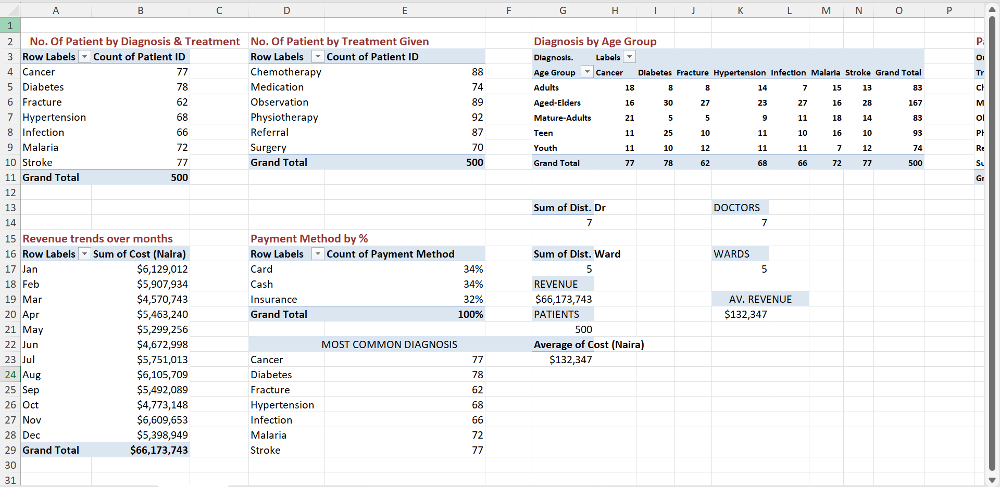
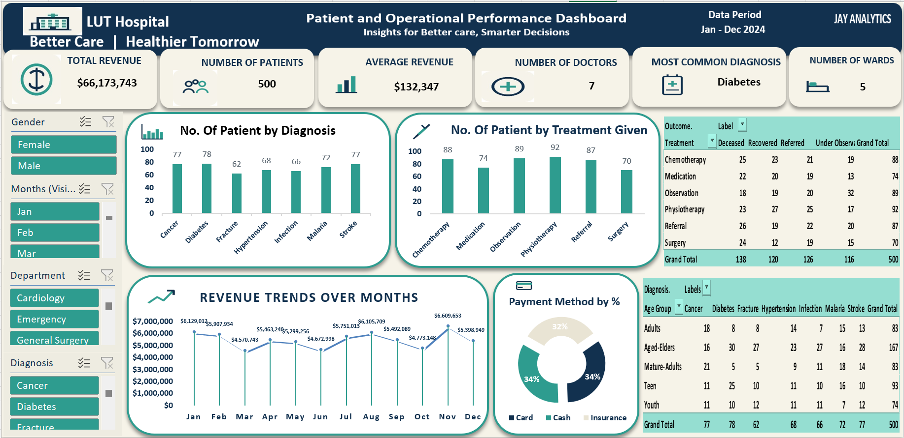

# LUT-Hospital-Analysis
Healthcare data analysis project using Excel to clean, analyze, and visualize patient data through Pivot Tables and an interactive dashboard.
# 🏥 LUT Hospital Patient & Healthcare Analytics

## 📊 Project Overview

This project analyzes **500 hospital patient records** to understand patient demographics, diagnoses, treatments, hospital outcomes, revenue, payment methods, doctor and ward utilization, and patient-related operational patterns.

The objective was to transform raw hospital records into a structured analytical solution that can help hospital management monitor performance, identify patterns, and make data-informed operational decisions.

The project was developed using **Microsoft Excel**, with data preparation, Pivot Table analysis, KPI development, and dashboard visualization.

---

## 🎯 Business Problem

Hospital management generates a large amount of patient and operational data, but raw records alone do not provide enough information for effective decision-making.

The key business questions addressed in this project include:

* How many patients were recorded?
* Which diagnoses are most common?
* Which treatments are most frequently administered?
* How are patients distributed across age groups?
* What are the patient outcomes?
* Which treatment types are associated with different patient outcomes?
* How is hospital revenue changing over time?
* Which payment methods are most commonly used?
* How many doctors and wards are represented?
* What is the average revenue per patient?
* How many patients require follow-up?
* What does the data indicate about patient satisfaction?

---

# 🗂️ Dataset

The dataset contains **500 patient** records and 21 fields covering patient demographics, diagnoses, treatments, hospital operations, financial information, and patient outcomes.

### Dataset Structure

| #  | Column                     | Description                                            |
| -- | -------------------------- | ------------------------------------------------------ |
| 1  | `Patient ID`               | Unique identifier assigned to each patient             |
| 2  | `Name`                     | Patient identifier/name                                |
| 3  | `Age`                      | Patient age in years                                   |
| 4  | `Gender`                   | Patient gender                                         |
| 5  | `Department`               | Hospital department responsible for the patient's care |
| 6  | `Diagnosis`                | Primary diagnosis recorded for the patient             |
| 7  | `Treatment`                | Treatment or intervention provided                     |
| 8  | `Doctor`                   | Doctor responsible for the patient's care              |
| 9  | `Visit Date`               | Date of the patient's hospital visit                   |
| 10 | `Stay Duration (days)`     | Number of days spent in the hospital                   |
| 11 | `Cost (Naira)`             | Cost/revenue associated with the patient's visit       |
| 12 | `Ward`                     | Ward assigned to the patient                           |
| 13 | `Payment Method`           | Method used to pay for the hospital service            |
| 14 | `Outcome`                  | Patient outcome after treatment                        |
| 15 | `Follow-Up Required`       | Indicates whether follow-up care is required           |
| 16 | `Satisfaction Score (1-5)` | Patient satisfaction rating                            |
| 17 | `Admission Time`           | Date and time the patient was admitted                 |
| 18 | `Discharge Time`           | Date and time the patient was discharged               |
| 19 | `Age Range`                | Derived age-group classification                       |
| 20 | `Dist. Dr`                 | Helper field used to identify distinct doctors         |
| 21 | `Dist. Ward`               | Helper field used to identify distinct wards           |

---

# 🧹 Data Cleaning & Preparation

Before performing the analysis, the dataset was reviewed and prepared for analytical use.

### Common Data Cleaning & Preparation Processes

#### 1. Missing Value Check

The dataset was checked for missing values across the available fields.

**Result:** No missing values were identified in the 500 patient records.

#### 2. Duplicate Check

Patient records were checked for duplicate entries.

**Result:** No duplicate rows were identified, and the `Patient ID` field contains unique patient identifiers.

#### 3. Data Type Validation

Fields were reviewed according to their intended analytical use, including:

* Patient IDs → Text
* Age → Numeric
* Visit Date → Date
* Cost → Numeric/Currency
* Stay Duration → Numeric
* Satisfaction Score → Numeric
* Admission/Discharge Time → Date & Time

#### 4. Age Group Creation

The `Age Range` field was created to convert individual patient ages into meaningful analytical groups:

* **Teen:** 0–17
* **Youth:** 18–29
* **Adults:** 30–44
* **Mature-Adults:** 45–59
* **Aged-Elders:** 60+

This makes it easier to analyze diagnoses and patient patterns by age group.

#### 5. Distinct Doctor Identification

The `Dist. Dr` helper column was used to identify distinct doctors and support the calculation of the total number of doctors.

#### 6. Distinct Ward Identification

The `Dist. Ward` helper column was used to identify distinct wards and support ward-level analysis.

#### 7. Data Consistency Checks

Categorical fields were reviewed for consistency across:

* Departments
* Diagnoses
* Treatments
* Doctors
* Wards
* Payment Methods
* Outcomes
* Follow-Up Status

---

# 📑 Workbook Structure

The Excel workbook contains **three main analytical layers**.

## 1️⃣ Clean Data

**Sheet:** `Clean Data`

This is the main dataset used for the analysis.

It contains:

* 500 patient records
* 21 columns
* Patient demographics
* Clinical information
* Treatment information
* Financial information
* Hospital operational information
* Derived analytical fields

📥 **Dataset / Excel Workbook:**
[Download the Excel Dataset](./data/LUT_Hospital_Analysis.xlsx)

---

## 2️⃣ Pivot Table Analysis

**Sheet:** `Pivot Table`

Pivot Tables were used to summarize the cleaned dataset and generate the metrics required for the dashboard.

The analysis includes:

### Patient Analysis

* Number of patients by diagnosis
* Number of patients by treatment

### Demographic Analysis

* Diagnosis by age group

### Treatment & Outcome Analysis

* Patient treatment by outcome

### Financial Analysis

* Monthly revenue
* Average revenue per patient

### Payment Analysis

* Payment method distribution

### Hospital Resource Analysis

* Number of doctors
* Number of wards

### Diagnosis Analysis

* Most common diagnoses
* Patient count by diagnosis

The Pivot Table layer serves as the **analytical engine** between the cleaned dataset and the final dashboard.

---

# 📊 Dashboard

**Sheet:** `Dashboard`

The dashboard converts the Pivot Table analysis into a management-friendly visual report.

The dashboard focuses on key hospital performance indicators including:

### Key Performance Indicators

* **Total Patients:** 500
* **Total Revenue:** ₦66.17M
* **Average Revenue per Patient:** ₦132,347
* **Total Doctors:** 7
* **Total Wards:** 5
* **Most Common Diagnosis:** Diabetes — 78 patients
* **Patients Requiring Follow-Up:** 251
* **Average Satisfaction Score:** 2.99 / 5

### Dashboard Analysis Areas

The dashboard presents information relating to:

* Patient volume
* Revenue performance
* Diagnosis distribution
* Treatment distribution
* Patient outcomes
* Payment methods
* Age groups
* Hospital resources

---

# 🔎 Key Findings

The analysis produced several notable observations.

### 1. Patient Volume

The dataset contains **500 patients** across the hospital departments and services analyzed.

### 2. Most Common Diagnosis

**Diabetes** was the most frequently recorded diagnosis, with **78 patients**, followed by Cancer and Stroke with 77 patients each.

### 3. Treatment Distribution

**Physiotherapy** was the most frequently recorded treatment with **92 patients**, followed by Observation with **89 patients**.

### 4. Revenue

Total recorded patient-related revenue was approximately **₦66.17 million**, with an average of approximately **₦132,347 per patient**.

### 5. Monthly Revenue

**November** recorded the highest monthly revenue at approximately **₦6.61 million**.

### 6. Payment Methods

Payment methods were relatively distributed across:

* Card — **34.2%**
* Cash — **33.8%**
* Insurance — **32.0%**

### 7. Follow-Up

**251 patients** were marked as requiring follow-up, compared with **249 patients** who did not require follow-up.

### 8. Patient Satisfaction

The average patient satisfaction score was approximately **2.99 out of 5**, indicating an opportunity to investigate factors affecting the patient experience.

---

# 💡 Business Recommendations

Based on the analysis, hospital management could consider:

### 1. Strengthen Diabetes Management

Since Diabetes was the most frequently recorded diagnosis, management could review diabetes-related resources, treatment capacity, and preventive-care programs.

### 2. Investigate Patient Satisfaction

The average satisfaction score of approximately **2.99/5** suggests that patient experience should be monitored closely. Management could investigate waiting times, service quality, communication, and other patient-experience factors.

### 3. Monitor Follow-Up Patients

With **251 patients requiring follow-up**, the hospital could strengthen its follow-up tracking process to reduce missed appointments and improve continuity of care.

### 4. Monitor Monthly Revenue

Revenue varied considerably across the months, with November reaching approximately **₦6.61M**. Management can investigate the operational factors behind monthly revenue fluctuations.

### 5. Maintain Balanced Payment Channels

The relatively balanced use of Card, Cash, and Insurance suggests that maintaining multiple payment options can support patient convenience and accessibility.

---

# 🛠️ Tools & Technologies

| Tool                   | Purpose                                                   |
| ---------------------- | --------------------------------------------------------- |
| **Microsoft Excel**    | Data cleaning, transformation, analysis and visualization |
| **Excel Pivot Tables** | Data aggregation and exploratory analysis                 |
| **Excel Charts**       | Visual representation of trends and distributions         |
| **Excel Formulas**     | Derived fields and analytical calculations                |
| **GitHub**             | Project documentation and portfolio presentation          |

---

# 🔄 Project Workflow

The project followed a structured data analytics workflow:

```text
Raw Patient Data
       ↓
Data Cleaning & Validation
       ↓
Data Preparation
       ↓
Derived Columns
       ↓
Pivot Table Analysis
       ↓
KPI Development
       ↓
Dashboard Visualization
       ↓
Business Insights
       ↓
Recommendations
```

---

# 📁 Recommended GitHub Repository Structure

To make the project easy for recruiters and hiring managers to navigate, the repository can be organized as follows:

```text
LUT-Hospital-Analysis/
│
├── README.md
│
├── data/
│   └── LUT_Hospital_Analysis.xlsx
│
├── dashboard/
│   └── LUT_Hospital_Dashboard.png
│
├── screenshots/
│   ├── clean-data.png
│   ├── pivot-table.png
│   └── dashboard.png
│
└── documentation/
    └── project-insights.md
```

---

# 📸 Project Screenshots

## Clean Dataset

The cleaned dataset contains the structured patient-level information used throughout the analysis.

**Screenshot:**


---

## Pivot Table Analysis

The Pivot Table sheet contains the analytical summaries used to generate the dashboard metrics and visualizations.

**Screenshot:**


---

## Hospital Dashboard

The dashboard provides a visual summary of hospital performance and patient-related metrics.

**Screenshot:**


---

# 📂 Project Files

| Resource                 | Location                            |
| ------------------------ | ----------------------------------- |
| Excel Workbook / Dataset | `./data/LUT_Hospital_Analysis.xlsx` |
| Clean Data               | `Clean Data` sheet inside workbook  |
| Pivot Table Analysis     | `Pivot Table` sheet inside workbook |
| Dashboard                | `Dashboard` sheet inside workbook   |
| Dashboard Screenshot     | `./screenshots/dashboard.png`       |
| Pivot Table Screenshot   | `./screenshots/pivot-table.png`     |

---

# 📈 Skills Demonstrated

This project demonstrates practical experience in:

* Data Cleaning
* Data Validation
* Data Transformation
* Exploratory Data Analysis
* Excel Formulas
* Pivot Tables
* KPI Development
* Dashboard Design
* Data Visualization
* Business Analysis
* Healthcare Analytics
* Business Insight Generation
* Data-Driven Decision Making

---

# 👤 About the Project

This project was developed as part of my **Data Analytics portfolio** to demonstrate how raw operational data can be transformed into meaningful business insights.

The focus was not only on creating a dashboard, but on following a complete analytics process:

**Clean → Analyze → Visualize → Interpret → Recommend**

The project demonstrates how Excel can be used to convert hospital data into actionable information for management and operational decision-making.

---

## 🔗 Project Links

**GitHub Repository:**
`[Add your GitHub repository link here]`

**Excel Dataset:**


**Dashboard:**


**Pivot Table Analysis:**


---

## ⭐ Conclusion

The LUT Hospital Analytics project demonstrates a complete Excel-based healthcare analytics workflow, from structured patient data preparation to Pivot Table analysis, KPI development, dashboard visualization, and business recommendations.

The project provides a practical example of how data analytics can support hospital management in understanding **patient trends, diagnoses, treatments, financial performance, resource utilization, outcomes, and patient experience.**
